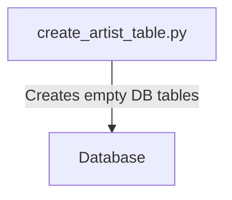
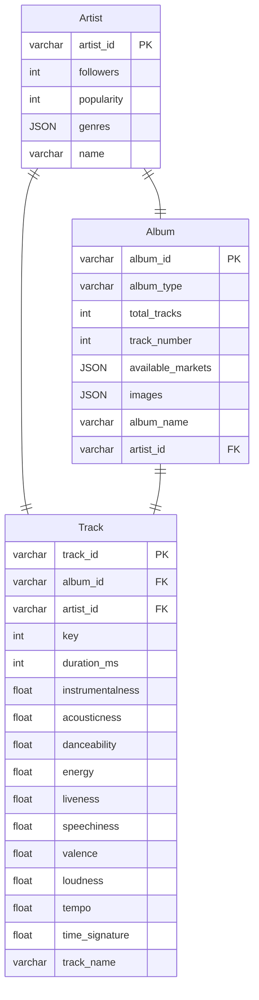

# Creating Tables in DB

## Current ERD Diagram (actual variables subject to change)
This is just what I have right now

# Flask App to Streamlit
This also retrieves User-related information

graph TD;
    main_py[main.py] -->|Redirects to /login| login[Flask: /login]
    login -->|Redirects to Spotify login page| AUTH_URL[Spotify Authorization URL]
    AUTH_URL --> |Redirects to /streamlit| streamlit
    streamlit --> |Fetches user information| Spotify_API[Spotify API]
    Spotify_API --> |Returns information| streamlit
    streamlit -->|Redirects to Streamlit UI| Streamlit_UI[Streamlit UI]

# Retrieval of Artist/Album/Track Information

graph TD;
    
    CheckArtist -->|No| spotify_api_py[spotify_api.py]
    spotify_api_py -->|Interacts with Spotify API| Spotify_API[Spotify API]

    spotify_db_py[spotify_db.py] -->|Check if Artist in DB| CheckArtist{Is Artist in DB?}
    
    CheckArtist -->|Yes| RetrieveInfo[Retrieve information from DB]
    RetrieveInfo -->engine
    engine --> streamlit_variables_py

    streamlit_variables_py -->|Displays visualizations| Streamlit_UI[Streamlit UI]
    
    Spotify_API -->|Fetches relevant information & stores in DB| engine[Database]

