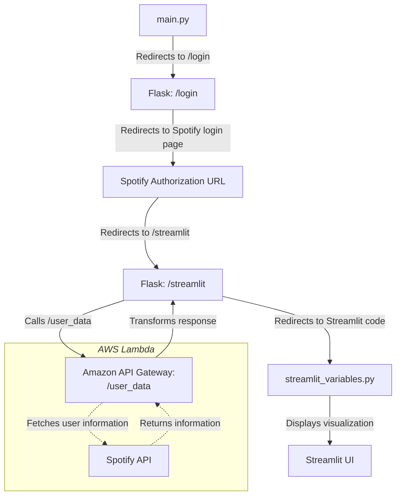
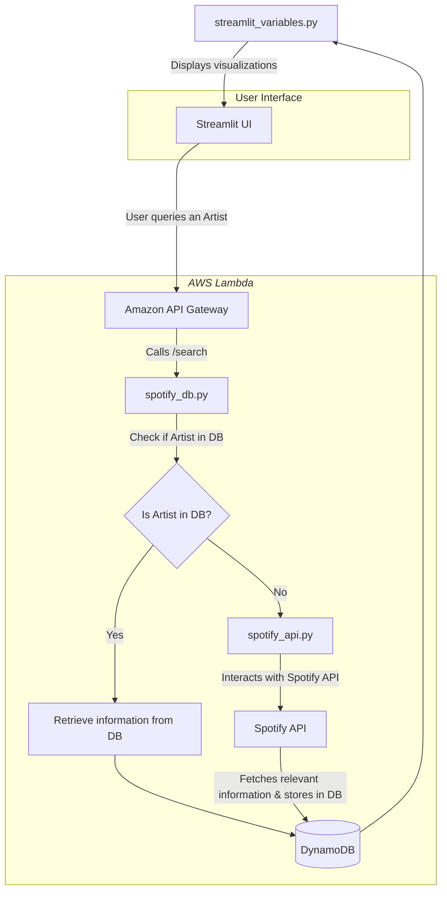
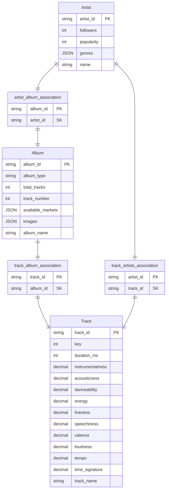

# User Dashboard : Flask App to Streamlit
This also retrieves User-related information via Spotify's own API

# Artist Query : Retrieval of Artist/Album/Track Information

## Current ERD Diagram (actual variables subject to change)
This is just what I have right now

