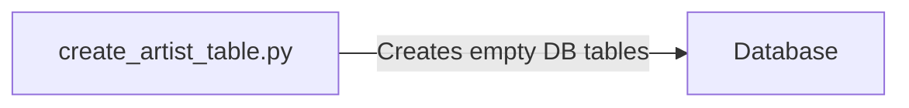
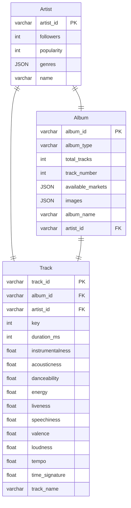
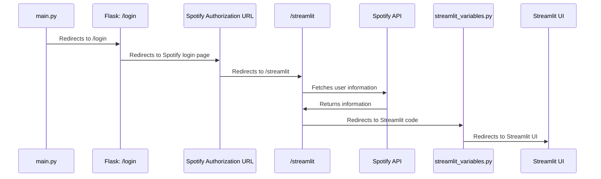
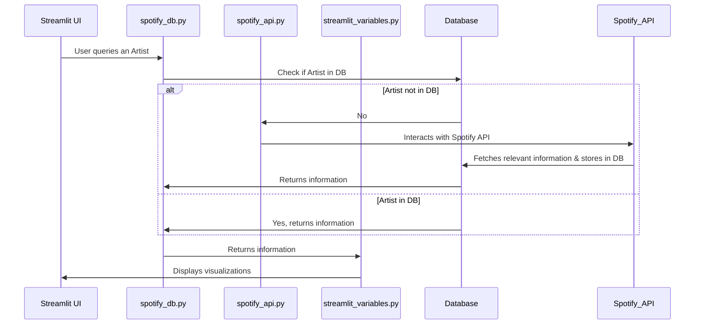

# Creating Tables in DB

## Current ERD Diagram (actual variables subject to change)
This is just what I have right now

# Flask App to Streamlit
This also retrieves User-related information

# Retrieval of Artist/Album/Track Information

